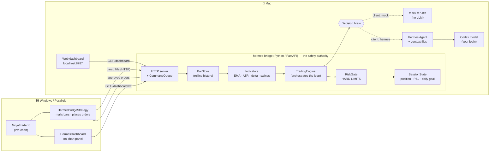
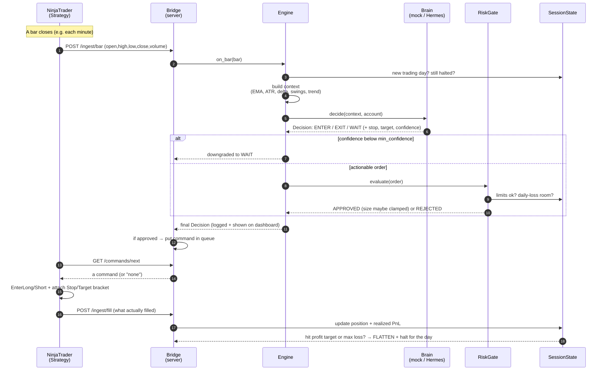
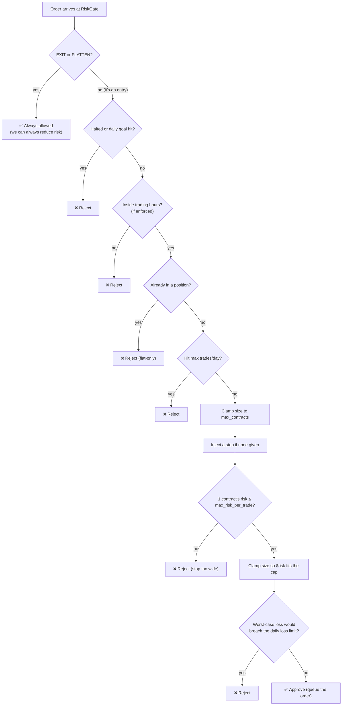

# Hermes × NinjaTrader 8 — Full Walkthrough

A plain-English tour of the whole system: what each part is, what it does, and how they
fit together so a closed price bar turns into a (simulated) trade. Read top to bottom and
you'll understand every piece without needing to read the code.

> **The one-sentence version:** NinjaTrader watches the market and mails each finished
> price bar to a Python **bridge**; the bridge asks a **brain** (either simple rules or
> the Hermes LLM) "enter, exit, or wait?", runs that answer through a hard **safety gate**,
> and sends any approved order back to NinjaTrader to execute on a **practice (Sim)**
> account — with a stop-loss attached every time.

---

## 1. The cast of characters

Think of it as a small team, each with one job:

| Part | Plain-English role | Lives on | File(s) |
|------|--------------------|----------|---------|
| **NinjaTrader 8** | The TV showing the live market | Windows (Parallels) | — |
| **The Strategy** | The mail carrier: mails each new bar to the bridge, places the orders it's told to | Windows (inside NT) | `ninjatrader/HermesBridgeStrategy.cs` |
| **The Bridge** | The desk + safety guard: keeps history, computes indicators, asks the brain, checks every order, keeps score | Mac | `bridge/hermes_bridge/*` |
| **The Brain** | The decision-maker: looks at the market and says enter / exit / wait | Mac | rules: `agent_client.py` · LLM: Hermes |
| **Hermes + Codex** | The actual "thinking" (an LLM, powered by your ChatGPT/Codex login) | Mac | `hermes/context/*`, `hermes/tools/*` |
| **The Dashboards** | The windows *you* watch it through | Browser + NT chart | `dashboard.py`, `HermesDashboard.cs` |

There are really **three running programs**: NinjaTrader (Windows), the bridge (Mac), and
the Hermes agent (Mac, only when the brain is set to `hermes`).

The guiding principle: **Hermes provides judgment, the bridge provides safety.** The brain
can *suggest* anything; it can never place an order that the bridge's safety gate hasn't
approved.

---

## 2. The big picture (diagrams)

### 2a. How the pieces connect

### 2b. The full process, one bar at a time

This is the loop that repeats on **every closed bar** — the heart of the system.

### 2c. What the safety gate checks (every entry)

---

## 3. Piece by piece

### A. NinjaTrader 8 + the Strategy — *the eyes and hands*

NinjaTrader is the only part that actually touches the market. The custom strategy file
`HermesBridgeStrategy.cs` runs **inside** NinjaTrader and does three simple things:

1. **Sends history once.** The moment the chart goes "live," it bulk-uploads every loaded
   bar to the bridge (`POST /ingest/history`) so the brain has context to work with.
2. **Streams each closed bar.** On every bar close it mails that bar to the bridge
   (`POST /ingest/bar`), then immediately asks "any orders for me?" (`GET /commands/next`).
   If there's a command, it runs it — `EnterLong` / `EnterShort` / `Exit` — and attaches a
   **stop-loss and profit-target bracket** in the same step.
3. **Reports fills.** Whenever an order actually executes, it tells the bridge
   (`POST /ingest/fill`) so the score stays accurate.

**Its own safety guard:** before trading, it checks the account name. If the account
doesn't look like a simulator (NinjaTrader's is `Sim101`) and `AllowLive` is `false`, it
**refuses to place any orders** and just keeps streaming data. This is the *real* live/sim
interlock, because only NinjaTrader knows which account is selected.

There's also a second, optional NinjaScript file — `HermesDashboard.cs` — an indicator
that draws a little status panel right on the chart (more in section F).

### B. The Bridge — *the desk and the safety guard*

This is the Python program at the center of everything (`bridge/hermes_bridge/`). It's a
small web server, and it's the **single place an order can leave for NinjaTrader**. Inside
it are several cooperating parts:

- **The server** (`server.py`) — exposes the web endpoints NinjaTrader and the dashboards
  talk to (`/ingest/bar`, `/commands/next`, `/health`, `/dashboard`, the kill switch, etc.)
  and holds the **command queue** that orders wait in until NinjaTrader picks them up.
- **The bar store** (`store.py`) — remembers the recent price history (a rolling window) so
  the brain always sees the last N bars, not just the latest one.
- **The indicators** (`indicators.py`) — turns raw bars into the numbers the brain reasons
  about: the fast/slow moving averages (EMA), the Average True Range (ATR, "how much it
  normally moves"), the swing highs/lows (structure), the trend direction, and
  **order-flow delta** (a measure of whether buyers or sellers were more aggressive).
- **The engine** (`engine.py`) — the conductor. Each bar it: stores the bar → builds the
  context → asks the brain → applies the confidence filter → runs the order through the
  safety gate → hands back the result. It also force-flattens you if the day's limit was
  hit while you were still in a trade.
- **Session state** (`session.py`) — the scorekeeper. Tracks your position, average price,
  realized profit/loss, how many trades today, and whether the day is "done." It owns the
  **daily-goal logic**: hit the profit target → stop taking new trades; hit the max loss →
  close everything and stop. It resets these counters at the start of each new day.
- **The risk gate** (`risk.py`) — the safety guard, detailed in section 2c above. **Every**
  order passes through it. It can shrink your order ("you asked for 2, you get 1") or reject
  it outright, and it *always* lets you exit. This is the rule the brain physically cannot
  talk its way around.

The bridge is also fully testable on its own: `make replay` runs synthetic bars through
this exact engine + gate with no NinjaTrader and no LLM, and `make test` runs the unit
tests (38 of them, all green).

### C. The Brain — *the decision-maker*

The brain answers one question per bar: **enter long, enter short, exit, or wait?** It also
suggests a stop and target and a confidence score. You choose between two brains in the
config (`agent.client`):

- **`mock` — deterministic rules** (`agent_client.py`, no LLM, free, instant). It encodes
  the exact strategy: in an uptrend, when a bar dips to "tag" the fast EMA and then closes
  back above it as an up-bar with non-negative order flow → go long (mirror for shorts).
  This is also the **safe fallback** and the engine used by the replay/test harness.
- **`hermes` — the LLM** (currently selected). The bridge sends the market state to the
  Hermes agent, which reads your strategy notes (section D) and replies with a decision in a
  structured format. If Hermes ever errors, times out, or replies with nonsense, the
  decision safely degrades to **WAIT** — it never guesses a trade on a broken answer.

Either way, the answer is just a *suggestion* until the risk gate approves it.

> **How the LLM is reached:** in `cli` mode the bridge shells out to `hermes -z "<prompt>"`,
> which reuses Hermes' own login resolution (your OpenAI **Codex** OAuth). That's why you
> log in with ChatGPT during setup. There's also an `in_process` mode that imports Hermes
> directly.

### D. The trading knowledge — *the context files*

This is the clever part: **the strategy isn't hard-coded — it's written in plain English**
in `hermes/context/`, and those notes are loaded straight into the LLM's instructions every
bar. Want it to trade differently? Edit the notes, restart the bridge. The files, in the
order the brain reads them:

| File | What it teaches the brain |
|------|---------------------------|
| `HERMES.md` | The operating loop and the non-negotiables ("always use a stop," "when unsure, WAIT," "one position at a time"). |
| `strategy.md` | **The only setup it trades:** trend pullback that tags the moving average and resumes, confirmed by order flow, with ATR-based brackets. |
| `order-flow.md` | How to read buying vs. selling pressure (delta, absorption, exhaustion) — the *confirmation* layer. |
| `price-action.md` | Trend, structure, and **location** ("the same candle is a great trade at one price and a terrible one at another") — the *context* layer. |
| `risk-management.md` | The hard limits and the behavioral rules (no revenge trading, no chasing, think in "R"). |
| `daily-goal.md` | Trade to a daily plan; bank green days; walk away at the max loss. |

Two more customization files round out the agent:

- `hermes/personalities/hermes-trader.md` — the agent's *voice*: calm, patient, concise,
  process-over-outcome.
- `hermes/tools/ninjatrader.py` — the agent's **hands**, the `nt_*` tools: `nt_recent_bars`
  (look at recent bars), `nt_account_status` / `nt_session_status` (check position & limits),
  `nt_place_order` / `nt_flatten` (act). Every one of these still goes through the risk gate.
- `hermes/cron/trading-session.yaml` — optional pre-open and post-close check-ins.

> **Note on the numbers in these files:** the context notes quote the *original* example
> limits (e.g. +$500 / −$400 / 10 trades). The **real, enforced** limits are always the ones
> in `config/trading.yaml` (currently tuned for MNQ — see section D + the test-profile note).
> The bridge enforces the config, not the prose.

### E. The configuration — *the one file you actually tune*

`config/trading.yaml` is the control panel. Everything has a safe default; you override what
you need. The sections:

- **`instrument`** — what you're trading (symbol `MNQ`, 1-minute bars, tick size/value).
- **`strategy`** — the indicator settings and two entry knobs: `min_confidence` (ignore
  weak signals) and `pullback_atr` (how deep a dip still counts as a setup), plus the ATR
  stop/target multipliers.
- **`risk`** — the hard caps: `max_contracts`, `max_risk_per_trade` ($), `max_trades_per_day`,
  and a default stop size to inject if a decision somehow lacks one.
- **`daily_goal`** — `profit_target` (stop winning at $X) and `max_daily_loss` (stop losing
  at $Y; also flattens you).
- **`session`** — optional "only trade during these hours" guard (off by default).
- **`agent`** — which brain (`mock` / `hermes`), and how to reach Hermes (`cli` vs
  `in_process`, the binary path, the context folder, timeout).
- **`server`** — the host/port the bridge listens on (`0.0.0.0:8787` so Windows can reach it).
- **`execution`** — `allow_live` (default **false**) and the account name. An advisory
  posture; the NinjaScript account guard is the real interlock.

### F. Watching it — *the dashboards*

Two views, same data, so you're never guessing what the robot is thinking:

- **Web dashboard** — open `http://localhost:8787/` (or the Mac's LAN IP from Windows). A
  live page showing position, P&L, trade count vs. goal, data freshness, the latest decision
  with its reason, and a scrolling history of recent decisions. Auto-refreshes every 3s.
- **On-chart panel** — the `HermesDashboard` indicator polls a pre-formatted text panel
  (`/dashboard.txt`) and draws it on the NinjaTrader chart, colored by position (green long,
  red short, gold when halted). No JSON parsing on the NinjaTrader side — the bridge formats
  it.

### G. Starting it all — *`start.sh`, scripts, Makefile*

- **`./start.sh`** is the one command for the Mac side. It reads your config, creates the
  Python environment on first run, validates the chosen brain (e.g. checks the `hermes`
  binary exists, or `--check-hermes` does a live ping), waits until the bridge answers
  `/health`, then **prints exactly what to type into NinjaTrader** (host, port, StrategyId,
  account) and streams the logs. `Ctrl-C` stops it cleanly. `./start.sh --mock` forces the
  no-LLM brain.
- **`Makefile`** — developer shortcuts: `make setup`, `make test`, `make replay`,
  `make serve`, `make lint`, `make clean`.
- **`scripts/`** — smaller helpers: `install_hermes.sh` (copy the customization into your
  Hermes install, optionally install Hermes itself), `run_bridge.sh` / `run_bridge_hermes.sh`
  (start the server), `healthcheck.sh` (ping `/health` + `/session/status`).

---

## 4. The life of one trade (a worked example)

To make it concrete, here's what actually happens when the agent decides to go long:

1. A 1-minute MNQ bar closes. NinjaTrader mails it to the bridge.
2. The bridge stores it and computes: trend is **up**, this bar dipped to the 9-EMA and
   closed back above it, delta is positive. Looks like the setup.
3. The brain returns **ENTER_LONG**, confidence 0.62, with a stop ≈ 1.5×ATR and target ≈
   2.0×ATR below/above entry.
4. Confidence (0.62) clears `min_confidence` (0.40), so it's actionable.
5. The risk gate checks everything: not halted ✔, flat ✔, under the daily trade cap ✔. It
   sizes the position so the stop's dollar risk stays under `max_risk_per_trade`, confirms
   the worst case wouldn't blow the daily loss limit, and **approves 1 contract**.
6. The approved order goes in the queue. NinjaTrader's next poll picks it up and runs
   `EnterLong(1)` **with the stop and target attached** as resting orders.
7. The fill comes back; the scorekeeper records the position.
8. Later, price hits the target (or the stop). NinjaTrader fills the bracket and reports it.
   Realized P&L updates. If that win pushed you to the daily profit target, the bridge
   flattens anything open and halts new entries until tomorrow. Green day banked.

If at step 5 anything failed — say you were already at the daily loss limit — the order is
**rejected**, the dashboard shows the reason, and nothing reaches NinjaTrader.

---

## 5. Safety, in layers (defence in depth)

The system is built **Sim-first**, with overlapping safeguards so no single failure trades
real money or runs away:

1. **NinjaScript account guard** — refuses any non-Sim account unless `AllowLive` is
   explicitly true. *(The real live/sim interlock.)*
2. **Bridge `allow_live` posture** — defaults false; loudly logged and shown on `/health`.
3. **The risk gate** — the hard limits on every single order (section 2c).
4. **Resting brackets** — every entry places a real stop + target in NinjaTrader, so even
   if the bridge or your Mac vanishes, the position is protected exchange-side.
5. **Fail-safe brain** — any LLM error or garbled reply becomes WAIT, never a trade.
6. **Kill switch** — `curl -X POST http://localhost:8787/control/flatten` flattens and halts
   instantly; `/control/resume` clears it.

> ⚠️ The bridge speaks plain HTTP with **no authentication**. Run it on `127.0.0.1` or a
> trusted private LAN only — never expose port 8787 to the internet.

---

## 6. How to run it (condensed)

The full, friendly version is in `docs/EASY-SETUP.md`; the developer version in
`docs/SETUP.md`. The short path:

1. **Install the brain (Hermes):** `curl -fsSL https://hermes-agent.nousresearch.com/install.sh | bash`
2. **Give it thinking power:** `hermes auth add openai-codex`, then `hermes model` → pick Codex.
3. **Build the desk:** `make setup`, then `make test` (expect "38 passed").
4. **(Optional) adjust the rules:** edit `config/trading.yaml` and the notes in `hermes/context/`.
5. **Start the desk:** `./start.sh` (or `./scripts/run_bridge.sh`). It prints the NinjaTrader settings.
6. **Add the mail carrier:** in NinjaTrader, compile `HermesBridgeStrategy.cs`, add it to an
   MNQ 1-minute chart, set `BridgeHost`/`BridgePort`/`StrategyId`, keep **`AllowLive: false`**
   and account **`Sim101`**, then Enable.
7. **Watch:** open `http://localhost:8787/` (and/or add the `HermesDashboard` indicator).

> Remember: after editing any config or context file, **restart the bridge** for it to take
> effect (the LLM's instructions are loaded once at startup).

---

## 7. Current state — the "relaxed test profile"

For testing, the entry rules are currently **loosened on purpose** so the agent trades more
often (every change is tagged `RELAXED (test)` in the files):

| Setting | Default | Now | Effect |
|---------|---------|-----|--------|
| `min_confidence` | 0.55 | **0.40** | Accepts lower-conviction entries |
| `pullback_atr` | 0.5 | **0.9** | More dips count as a valid setup |
| `max_trades_per_day` | 10 | **20** | More entries allowed per session |
| `strategy.md` order-flow gate | required positive delta | only vetoes on *clearly* negative | Fewer setups blocked |
| `strategy.md` location gate | hard "~1R room" rule | a preference, not a blocker | Fewer setups blocked |

The **risk envelope is unchanged**: same per-trade stop bracket, same `$250` per-trade cap,
same `$120` daily-loss auto-flatten, still Sim-only. So it trades *more often*, not *bigger*.
To return to the stricter behavior, revert those tagged lines in `config/trading.yaml` and
`hermes/context/strategy.md` and restart the bridge.

---

## 8. Mini-glossary

- **Bar / candle** — one time slice of price: open, high, low, close, volume.
- **EMA** — exponential moving average; the fast vs. slow relationship defines the trend.
- **ATR** — Average True Range; "how much this market normally moves," used to size stops.
- **Delta / order flow** — whether aggressive buyers or sellers dominated; the confirmation.
- **Pullback** — a small counter-trend pause inside a trend; what this strategy buys/sells.
- **Bracket** — a stop-loss + profit-target pair attached to an entry.
- **R** — one unit of risk (your stop distance in dollars); targets are measured in R.
- **Flatten / halt** — close everything and stop trading (for the day, or via kill switch).
- **Sim** — simulated/paper account; no real money at risk.
